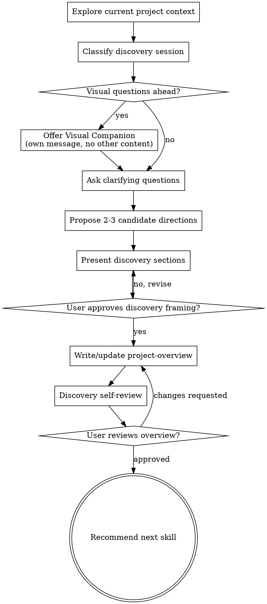

# Discovery Before Architecture Or Mid-Build Reframing

Turn rough product ideas, feature ideas, and workflow uncertainties into approved framing before architecture, bootstrap, or further implementation.

This skill is discovery plus brainstorming for both project start and in-progress development. It exists for moments when repo, feature work, or architecture discussion should **not** move faster than product understanding.

Start by understanding current project context, then ask focused questions one at a time. Once product intent is clear enough, present discovery findings in sections, get user confirmation, then write or update `context/project-overview.md`.

<HARD-GATE>
Do NOT invoke `/architect`, `/bootstrap`, `/implement`, write code, scaffold the repo, or take implementation action until you have presented the discovery framing and the user has approved it.
</HARD-GATE>

## Anti-Pattern: "We Can Figure Product Out While Building"

Most expensive project mistakes happen before code. Repo shape hardens around assumptions, stack choices lock early, and architecture starts solving problems nobody agreed were the real product.

Even when discovery is short, do it on purpose. A small app can need only a few tight exchanges. But product intent, target user, MVP scope, and major constraints still need to be surfaced before architecture begins.

## What This Skill Owns

This skill owns pre-architecture product discovery.

Main artifact:

- `context/project-overview.md`

It may also produce in conversation or as draft notes:

- discovery framing
- target user definition
- problem statement
- core user journeys
- MVP scope
- non-goals
- success criteria
- stack candidates or stack preferences
- constraints, risks, assumptions, and gaps
- recommendation for next skill

This skill does not finalize architecture, bootstrap context, scaffold code, or plan feature-by-feature implementation.

## When to Use It

Use this skill when:

- developer says “let’s brainstorm” or wants discovery first
- project is new and repo should not be scaffolded blindly
- starter repo exists but product purpose is still unclear
- product direction exists only as rough idea
- stack is undecided or only partly decided
- important unknowns should be resolved before architecture
- team needs humans and agents aligned on same product framing

Good examples:

- “Help me think through this product before we scaffold app.”
- “I want to adapt this starter repo, but first I need proper discovery.”
- “Let’s define MVP, users, and stack direction before architecture.”
- “I know general idea, but I want brainstorming first so repo doesn’t drift.”

Do not use this skill for:

- feature-level planning inside already-defined product
- repo repair or context drift repair
- code scaffolding
- architecture-level file ownership and technical design
- debugging or implementation

Those belong to `/architect`, `/bootstrap`, or other later skills.

## Checklist

You MUST create a task for each of these items and complete them in order:

1. **Explore current project context** — inspect repo/docs/current assumptions
2. **Classify discovery session** — greenfield, base-repo adaptation, reset, or uncertain scope
3. **Offer visual companion** (if upcoming questions are likely visual) — own message only, no bundled question
4. **Ask clarifying questions** — one at a time, focused on product/user/scope/constraints
5. **Propose 2-3 candidate directions** — usually MVP framing, scope cuts, or stack direction with trade-offs
6. **Present discovery sections** — product intent, users, flows, scope, constraints, gaps, next step; get user approval after sections
7. **Write or update `context/project-overview.md`** — only after discovery framing is approved
8. **Discovery self-review** — remove ambiguity, assumptions presented as facts, over-scoped MVP, or architecture leakage
9. **User reviews written overview** — ask user to review file before transition
10. **Recommend next skill** — usually `/architect`, sometimes `/bootstrap`

## Process Flow



## The Process

### 1. Explore current project context

Check current project state first.

Look for:

- repo shape and what already exists
- docs and context files
- whether repo is greenfield, adapted starter, or half-shaped product
- any hard constraints already visible from code, docs, or user prompt
- any assumptions already frozen into repo naming or structure

Do not begin with deep technical solutioning. Goal here is to understand what kind of discovery session this is.

### 2. Classify discovery session

Classify situation as one of:

- **greenfield** — new product, repo not meaningfully shaped yet
- **base-repo adaptation** — starter exists, but new product framing must replace template assumptions
- **reset** — existing project needs product re-clarification before continuing
- **uncertain scope** — product idea exists, but users/MVP/stack choices are still vague

Restate in plain language:

```md
## Discovery framing

- Project state: [greenfield / base-repo adaptation / reset / uncertain scope]
- What developer already knows: [facts]
- What is still unclear: [gaps]
- What this session needs to produce: [outcomes]
```

If request is already concrete and complete, say so. Do not force long discovery when short confirmation is enough.

### 3. Ask clarifying questions

Ask one question per message.

Focus on:

- what product is
- what problem it solves
- who it is for
- why that user cares
- what primary user journey is
- what first useful version must do
- what is explicitly out of scope
- what constraints or preferences matter

Prefer multiple-choice when possible. Open-ended is fine when needed.

Push vague claims into concrete language:

- “AI app” → what user task and visible output?
- “dashboard” → what decisions does user make from it?
- “marketplace” → who supplies, who buys, what transaction matters?
- “agent” → what trigger, inputs, output, user value?

If request implies several independent systems, stop and decompose before continuing. Discovery should narrow scope, not accidentally approve giant product surface.

### 4. Surface constraints and preferences early

Once product is understandable, capture forces that will shape architecture later.

Cover:

- preferred base repo or framework
- stack preferences
- backend/service preferences
- auth needs
- deployment constraints
- privacy/compliance/data boundaries
- delivery bias: speed, cost, flexibility, polish, simplicity
- team size and maintainers
- whether app is mostly CRUD, workflow, search, content, agentic, realtime, or analytics heavy

Use this structure:

```md
## Constraints and preferences

- Preferred stack: [value / undecided]
- Fixed constraints: [list]
- Soft preferences: [list]
- Delivery bias: [speed / flexibility / low cost / polish / simplicity]
```

Do not treat every preference as fixed unless user says it is fixed.

### 5. Propose 2-3 candidate directions

Before converging, propose 2-3 plausible directions with trade-offs.

These usually vary by one of:

- MVP scope cut
- target user emphasis
- product workflow shape
- stack direction at discovery level

Lead with recommendation. Explain why.

Examples:

- narrower operator-first MVP vs broader multi-role MVP
- CRUD-heavy admin-first foundation vs workflow-first product slice
- safe stack decisions to lock now vs decisions better left for architecture

Goal is not to design folders or packages. Goal is to compare possible product framing and early technical direction.

### 6. Present discovery sections

Once understanding is strong enough, present discovery findings in sections scaled to complexity.

Cover most or all of:

- project framing
- target user
- problem statement
- core user flow
- MVP scope
- out-of-scope
- constraints and preferences
- stack direction
- gaps and assumptions
- recommended next step

Ask after each section or natural group whether it looks right so far.

Use these formats where helpful:

```md
## Stack direction

- Safe to lock now:
  - [decision]
- Should stay open until architecture:
  - [decision]
- Potential mismatch or risk:
  - [issue]
```

```md
## Gaps and assumptions

### Confirmed

- [fact]

### Assumed

- [assumption]

### Needs decision

- [open question]
```

```md
## MVP scope

### In scope

- [capability]

### Out of scope

- [capability]

### First release standard

- [what must feel complete]
```

Do not bury uncertainty in prose. Separate confirmed facts from assumptions and open decisions.

### 7. Write or update `context/project-overview.md`

Only after user approves the discovery framing, write or revise `context/project-overview.md`.

This file should explain:

- what project is
- problem it solves
- target user
- core user flow
- pages or major surfaces if known
- features in scope
- features out of scope
- success criteria

Do not let architecture detail leak into this file. `project-overview.md` is product intent and scope, not implementation design.

If important items remain unresolved, include:

```md
## Needs confirmation

- [open decision]
```

### 8. Discovery self-review

After writing overview, review it with fresh eyes:

1. **Placeholder scan:** any TODO/TBD/vague filler? Fix it.
2. **Fact vs assumption check:** did any assumption get written like settled truth? Fix it.
3. **Scope check:** is MVP still small enough to architect cleanly? If not, narrow it.
4. **Architecture leakage check:** remove file structure, package, or ownership details that belong in `/architect`.
5. **Ambiguity check:** can any requirement be read two ways? Make one interpretation explicit.

Fix inline. No need for dramatic ceremony.

### 9. User review gate

After self-review, ask user to review written overview before moving on:

> "Discovery overview written to `context/project-overview.md`. Please review it and tell me what to change before we move to architecture."

Wait for response. If user requests edits, make them and re-run self-review.

### 10. Recommend next correct step

After approval, recommend next stage explicitly:

- if product framing is approved but system shape is not decided → `/architect`
- if product framing and architecture already exist but context wiring is missing → `/bootstrap`
- if context and architecture are already healthy → move to feature planning or implementation

Use this format:

```md
## Recommended next step

- Next skill: [/architect / /bootstrap]
- Why: [short reason]
- What should be produced next: [artifact]
```

Default progression:

1. `/discover`
2. `/architect`
3. `/bootstrap`
4. feature work

## Key Principles

- **One question at a time** — do not dump long interrogations
- **Multiple choice preferred** — easier for user to answer quickly
- **Converge, do not meander** — discovery should reduce ambiguity
- **Always compare options** — present 2-3 plausible directions before locking framing
- **Separate facts from assumptions** — make uncertainty visible
- **MVP discipline** — smaller first cut beats fuzzy giant scope
- **No premature architecture** — discovery shapes product, not folder trees
- **Get approval before transition** — discovery must be accepted before architecture starts

## Visual Companion

A browser-based companion for mockups, diagrams, and visual comparisons during discovery. Accepting it makes visuals available when useful; it does not mean every question goes through browser.

**Offer it only if upcoming questions are likely visual.** Use this exact standalone message and nothing else:

> "Some of what we're working on might be easier to explain if I can show it to you in a web browser. I can put together mockups, diagrams, comparisons, and other visuals as we go. This feature is still new and can be token-intensive. Want to try it? (Requires opening a local URL)"

Do not combine that offer with clarifying questions or summaries. Wait for response first. If they decline, continue in text.

If they accept, read:
`skills/brainstorming/visual-companion.md`

## Final Reminder

Do not scaffold from vibes.

If product is fuzzy, discover first.
If product is clear but system shape is not, architect next.
If decisions are approved and repo needs structure, bootstrap then.
