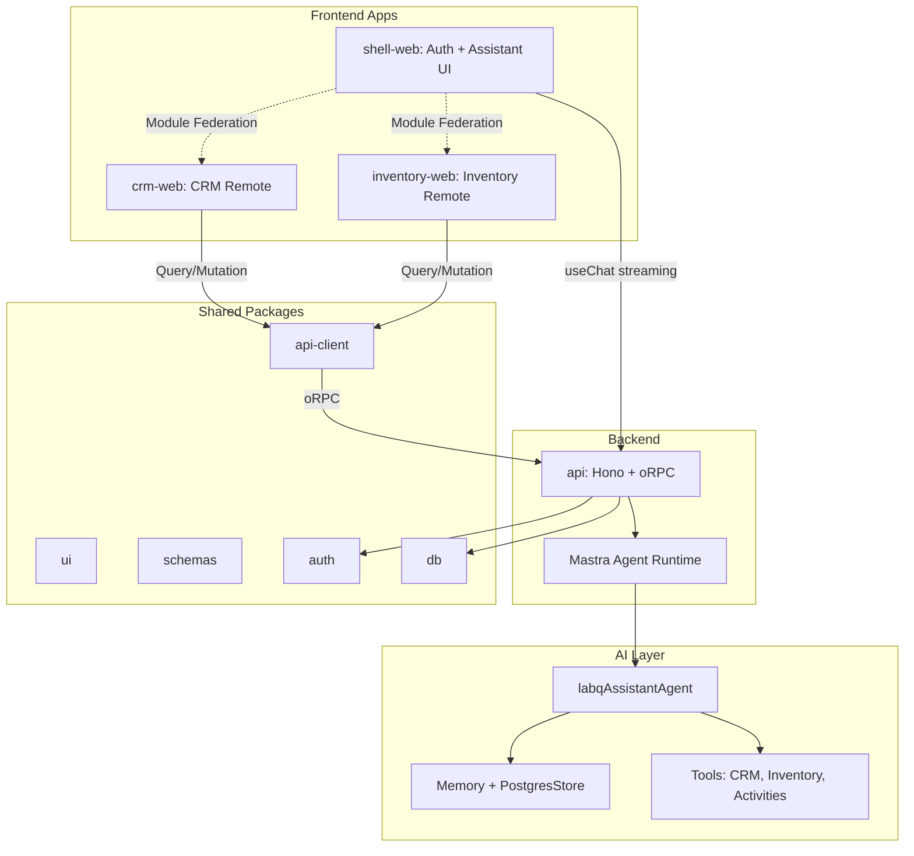
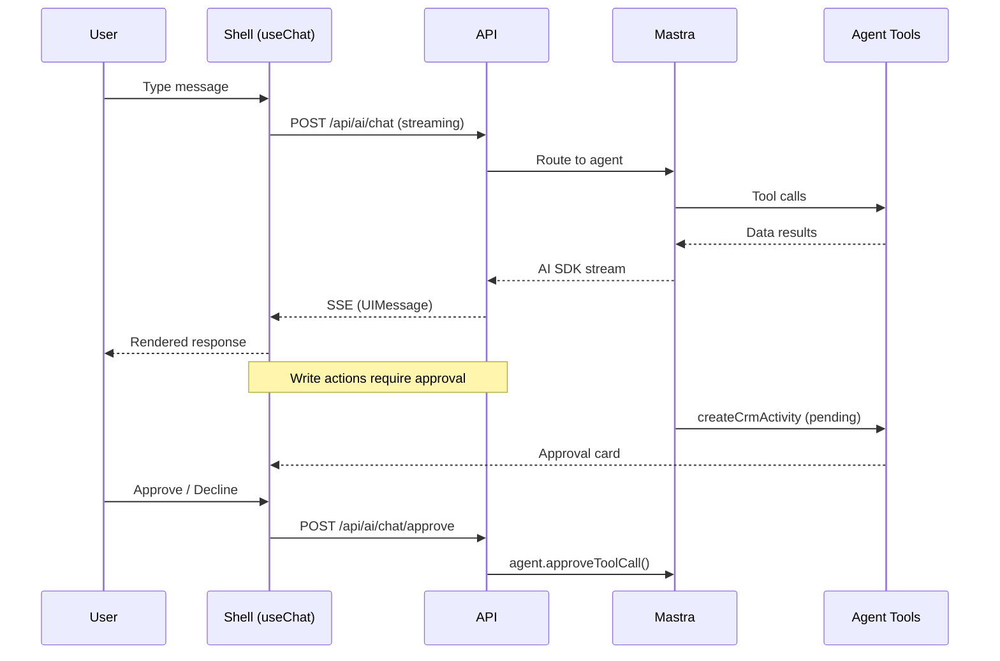

# LabQ Modules

Modular internal tools platform — multi-tenant, organization-scoped business apps (CRM, Inventory) with a built-in AI assistant. Built as a developer-first starter kit inspired by Odoo's breadth but with modern React architecture.

## Quick Start

```bash
# 1. Install dependencies
pnpm install

# 2. Copy env file
cp .env.example .env

# 3. Start PostgreSQL + MinIO
docker compose up -d postgres minio minio-setup

# 4. Push database schema
pnpm db:push

# 5. Start all dev servers
pnpm dev
```

| App       | Port | URL                   |
| --------- | ---- | --------------------- |
| Shell     | 3100 | http://localhost:3100 |
| CRM       | 3101 | http://localhost:3101 |
| Inventory | 3102 | http://localhost:3102 |
| API       | 4000 | http://localhost:4000 |

## Architecture



### Monorepo Structure

```
apps/
  shell-web         Auth host, module guards, settings, AI assistant (port 3100)
  crm-web           CRM remote via Module Federation (port 3101)
  inventory-web     Inventory remote via Module Federation (port 3102)
  api               Hono + oRPC backend + Mastra agent runtime (port 4000)

packages/
  ui                shadcn/ui + Tailwind OKLCH design system
  schemas           Shared Zod validation (API ↔ form layers)
  api-client        oRPC client factory + TanStack Query config
  module-contract   Remote module manifest interface
  auth              Better Auth + Organization plugin
  db                Drizzle ORM schema, migrations, seed
  env               @t3-oss/env-core validation
  types             Shared literal types + permissions
  email             React Email + Resend client
  config            Shared tsconfig
```

---

## Tech Stack

| Layer           | Technology                                                          |
| --------------- | ------------------------------------------------------------------- |
| Frontend        | React 19, Vite, React Router, TanStack Query, shadcn/ui             |
| Backend         | Hono, oRPC, Drizzle ORM                                             |
| Auth            | Better Auth + Organization plugin (RBAC: owner/admin/member/viewer) |
| Database        | PostgreSQL 16 with Row Level Security                               |
| Storage         | S3-compatible (MinIO local / Cloudflare R2 prod)                    |
| Module System   | @module-federation/vite                                             |
| AI Assistant    | Mastra, Vercel AI SDK 6, @ai-sdk/react 3                            |
| Testing         | Playwright (E2E), Vitest (unit), react-doctor, fallow               |
| Package Manager | pnpm (workspace)                                                    |
| Runner          | Vite Plus (`vp`)                                                    |

---

## Engineering Decisions

### 1. Frontend Modularity via Module Federation

To scale product development across disjoint domains and isolate deployment risk. `crm-web` and `inventory-web` are independent micro-frontends that share runtime singletons (`react`, `react-dom`, `react-router-dom`, `@tanstack/react-query`, `nuqs`). Remotes wrap their routing in a local `NuqsAdapter` so URL state stays live even when the host's adapter is unreachable.

### 2. Type-Safe Client-Server (oRPC + Hono)

oRPC maps TypeScript types from Hono handlers to React Query hooks — full type safety across network boundaries with zero code generation. Zod schemas (`packages/schemas`) are shared between form validation and API inputs. Binary streams (S3 uploads/downloads) bypass oRPC via native Hono routes.

### 3. Strict Organization Scoping

Multi-tenancy at the session layer via Better Auth's Organization plugin. Default workspace bootstraps on signup. Soft-delete pattern (`deletedAt`) + audit fields (`createdBy`, `updatedBy`) across all CRM and inventory tables.

### 4. URL-Driven State

List pages use TanStack Table bound to URL query parameters via `nuqs`. Text search debounced (300ms). Column filters compressed into a single backend `search` parameter for index optimization. Bookmarkable, shareable views.

### 5. Deterministic Form Lifecycles

TanStack Form + Zod. Open/close handlers explicitly call `form.reset(EMPTY_FORM)`. Conditional fields use form-level listeners to clear hidden dependent values. No leaked inputs across record selection.

---

## AI Assistant

Built-in chat assistant powered by [Mastra](https://mastra.ai/) + [Vercel AI SDK](https://sdk.vercel.ai/). Lives as a floating sheet in the shell app.



**Tools:**
| Tool | Action | Approval |
|------|--------|----------|
| `getPlatformInfo` | Read modules, permissions, org status | Auto |
| `readCrmData` | Read leads, contacts, companies, deals, activities | Auto |
| `readInventoryData` | Read products, locations, movements, balances | Auto |
| `createCrmActivity` | Create notes, tasks, calls, meetings | **Human required** |

**Persistence:** Chat history in PostgreSQL `mastra` schema via `@mastra/pg`. Per-user, per-workspace isolation. Transcript hydrates on open with `safeValidateUIMessages()`.

**Key files:**

- `apps/api/src/mastra/agents/assistant-agent.ts` — Agent definition + tools
- `apps/api/src/mastra/tools/` — Tool implementations
- `apps/shell-web/src/features/assistant/` — UI (sheet, button, composer)
- `apps/api/src/index.ts` — `/api/ai/chat`, `/history`, `/approve`, `/decline`

### Adding a New Tool

```typescript
import { createTool } from "@mastra/core/tools";
import { getContext } from "@mastra/core/request-context";

export const myTool = createTool({
  id: "my-tool",
  description: "What it does",
  inputSchema: z.object({ ... }),
  execute: async ({ context }) => {
    const { userId, organizationId } = getContext();
    return { result: ... };
  },
});
```

Register in `apps/api/src/mastra/agents/assistant-agent.ts` → `tools` object. For write actions, add approval gating.

---

## Testing

### E2E — Playwright

Full end-to-end browser tests covering auth flows, CRUD operations, AI assistant, file operations, and URL state management.

```bash
pnpm test:e2e          # Run all E2E tests
pnpm test:e2e:ui       # Open Playwright UI mode
pnpm test:e2e:debug    # Debug with inspector
pnpm test:e2e:headed   # Run in headed browser
pnpm test:e2e:report   # View HTML report
```

**Test suites (`e2e/`):**

| File                             | Coverage                                                                                                                                                                        |
| -------------------------------- | ------------------------------------------------------------------------------------------------------------------------------------------------------------------------------- |
| `auth-flow.spec.ts`              | Sign up, sign in/out, module guards, CRM CRUD (contacts, companies, deals), Inventory CRUD (products, locations, stock movements + balance verification), module enable/disable |
| `assistant-chat.spec.ts`         | Transcript persistence across refresh, history pagination with "Load earlier", mobile responsive bottom sheet, scroll-to-bottom affordance                                      |
| `contacts-import-export.spec.ts` | CSV export headers, invalid CSV validation blocking, valid CSV import with preview                                                                                              |
| `contacts-attachments.spec.ts`   | S3 file upload, download, and delete via contact detail page                                                                                                                    |
| `data-table.spec.ts`             | URL state sync for text filter, column sort, and page size                                                                                                                      |
| `backend.test.ts`                | Permission model (owner/admin/member/viewer), error codes, module keys                                                                                                          |

**Config:** `playwright.config.ts` — Chromium only, auto-starts API + all 3 frontend servers, 30s timeout, retries on CI, traces on first retry, screenshots on failure.

### Unit — Vitest

```bash
pnpm test           # Run all unit tests
pnpm test:watch     # Watch mode
```

Unit tests validate business logic in isolation — permission model, error codes, module keys, and shared utilities.

### Code Quality

```bash
pnpm check              # Lint + format (fix mode)
npx react-doctor <dir>  # React perf/arch audit
npx fallow audit        # Dead code, duplication, complexity detection
```

**React Doctor scores (apps only):**

| App             | Score | Rating  |
| --------------- | ----- | ------- |
| `inventory-web` | 100   | Perfect |
| `shell-web`     | 94    | Great   |
| `crm-web`       | 89    | Great   |

---

## Module Code Generator

Scaffold a new remote micro-frontend module:

```bash
pnpm create:module --key <key> --name <Name> [--port <port>] [--description "<desc>"]
```

**Parameters:**

- `--key` — Unique lowercase key (e.g., `billing`)
- `--name` — Display name (e.g., `Billing`)
- `--port` — Auto-selected if omitted
- `--description` — Optional module description
- `--dryRun` — Validate without writing

**What it generates:**

- Remote app with standard routing tree + `NuqsAdapter`
- `src/runtime.ts` query client configuration
- Shell host registration (nav, settings, module guard)
- Permission nodes (`<key>.view/create/update/delete`)
- DB module enum entry
- Dev/build scripts

Fail-closed: duplicate keys, port collisions, or missing anchors stop generation.

---

## Commands

```bash
pnpm dev                            # Shell + API + all modules
pnpm dev -- crm                     # Shell + API + CRM only
pnpm dev -- inventory               # Shell + API + Inventory only
pnpm dev -- --modules=crm,inventory # Shell + API + explicit modules
pnpm build                          # Build all packages
pnpm check                          # Lint + format
pnpm test                           # Unit tests (Vitest)
pnpm test:e2e                       # E2E tests (Playwright)
pnpm db:push                        # Push Drizzle schema
pnpm db:studio                      # Open Drizzle Studio
pnpm create:module                  # Scaffold new remote module
```

---

## AI-Agent Native Development

This repo is pre-configured for LLM coding assistants (Claude, Cursor, etc.).

### Context Operating System

`context/` files are read in order before any code changes:

| File                           | Purpose                                                           |
| ------------------------------ | ----------------------------------------------------------------- |
| `project-overview.md`          | Product positioning, success criteria                             |
| `architecture.md`              | Monorepo boundaries, Federation config, data flow                 |
| `ui-tokens.md` / `ui-rules.md` | OKLCH colors, typography, layout constraints                      |
| `ui-registry.md`               | Existing UX patterns (DataTable, forms, timelines)                |
| `code-standards.md`            | TypeScript strict mode, soft-delete, audit fields                 |
| `library-docs.md`              | Third-party library reference (Auth, Hono, oRPC, Drizzle, Mastra) |
| `build-plan.md`                | Phased roadmap                                                    |
| `progress-tracker.md`          | Completed items + remaining debt                                  |

### Agentic Skills

| Skill            | Purpose                                                 |
| ---------------- | ------------------------------------------------------- |
| `discover`       | Clarify requirements before design                      |
| `architect`      | Blueprint creation + execution sequencing               |
| `remember`       | Persist decisions across sessions (`memory.md`)         |
| `imprint`        | Extract visual patterns → `ui-registry.md`              |
| `impeccable`     | Frontend design system audit + polish                   |
| `syncdocs`       | Reconcile code ↔ documentation drift                    |
| `recover`        | Classify failures (Targeted Fix / Hard Reset / Rethink) |
| `caveman-commit` | Terse conventional commits                              |
| `graphify`       | Code/docs → knowledge graph                             |

---

## Roadmap

### Completed

- Auth + workspace scoping (signup auto-creates workspace)
- CRM remote (leads, contacts, companies, deals, pipeline, activities, attachments)
- Inventory remote (products, locations, movements, balances)
- CSV import/export with validation
- AI assistant (Mastra + AI SDK, streaming, persistence, tool approval)
- Module code generator
- E2E test coverage (6 spec files)
- React Doctor audit pass (apps scoring 89–100)

### Upcoming

- PostgreSQL RLS policies
- Inventory RBAC enforcement
- Typecheck cleanup (`packages/env/src/web.ts`)
- Assistant tool expansion (write tools for CRM entities + Inventory)
